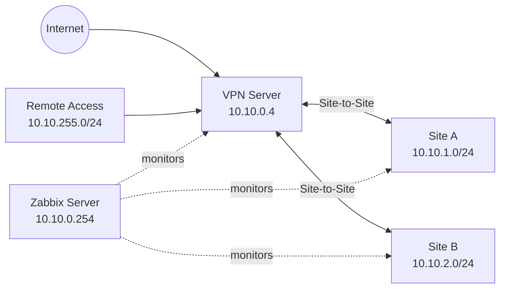

# HomeLab Infrastructure

[日本語](README.md) | [English](README.en.md)

A multi-site HomeLab infrastructure portfolio currently hosted on AWS. It integrates Terraform, strongSwan, PKI, Zabbix, SNMPv3, and failure notification while keeping the public design provider-neutral for a future platform move.

## Architecture

## What I Built

An AWS-hosted VPN and monitoring platform connecting two sites and certificate-authenticated remote clients. The design includes reproducible infrastructure, operational monitoring, notification, and rebuild documentation.

## Key Technologies

AWS, Terraform, strongSwan, Site-to-Site VPN, EAP-TLS, PKI/CA/CRL, Cisco Catalyst 1300, MikroTik, SNMPv3, Zabbix, Python, systemd, Zabbix Agent2, and GitHub.

## Design Goals

- Secure remote access and multi-site connectivity
- Infrastructure as code and secret separation
- Failure detection, Slack notification, and recovery notification
- Rebuildability from canonical source

## Network & VPN

The example topology uses AWS `10.10.0.0/24`, Site A `10.10.1.0/24`, Site B `10.10.2.0/24`, and Remote Access `10.10.255.0/24`. Remote Access uses `vpn.example.com` and a `10.10.0.0/16` local traffic selector in the example configuration.

## PKI & Remote Access

The design uses a HomeLab CA, server and site certificates, client certificates, CRL generation, and certificate issue/revoke workflows. Private keys and credentials are excluded.

## Monitoring

The monitoring design covers server OS health, VPN/collector state, router and switch telemetry, NAS health, and ICMP-only access points. The flow is `Item → Trigger → Problem → Action → Slack → Recovery`.

## Custom Implementations

- Python VICI VPN collector with freshness and event normalization
- Catalyst 1300 temperature, sensor status, and power monitoring
- Zabbix templates and frontend modules
- Dashboard and Slack action definitions
- systemd, Agent2, and logrotate integration

## Infrastructure as Code

Terraform provisions the monitoring subnet, routes, security groups, IAM, SSM documents, and fixed-AMI Zabbix EC2 design.

## Security Design

Secrets are injected outside Git. The design uses least-privilege security groups, certificate authentication, allowlisted export, and fail-closed validation.

## Failure Detection

`Item → Trigger → Problem → Action → Slack → Recovery` is validated as the operational notification chain.

## Rebuildability

Canonical source, sanitized templates, collector code, systemd definitions, Terraform, and rebuild documentation are kept separately from runtime state and credentials.

## Design Decisions

### VPN visibility

Standard monitoring alone did not expose sufficient VPN SA/session visibility. A Python collector normalizes VICI state and exposes it through Agent2; freshness/state Items, a dashboard, and frontend modules connect Site-to-Site and Remote Access state and history to Zabbix.

### Catalyst 1300 monitoring

Generic SNMP did not expose enough device-specific telemetry. Only SNMPv3 objects verified against the device are used; a custom template monitors temperature, power, CPU telemetry, and sensor state, while unverified memory and fan metrics remain intentional non-monitoring decisions.

### End-to-end notification

The operational chain is verified from Item to Trigger, Problem, Action, Slack, and Recovery, including Problem and Recovery delivery paths.

## Repository Structure

- [Architecture](docs/architecture.md)
- [VPN](docs/vpn.md)
- [Monitoring](docs/monitoring.md)
- [Security](docs/security.md)
- [Rebuildability](docs/rebuildability.md)
- [terraform/](terraform/)
- [strongSwan/](strongswan/)
- [monitoring/](monitoring/)

See the generated artifact's `docs/`, `terraform/`, `strongswan/`, and `monitoring/` directories for details.

## Sanitization Notice

This repository is generated from a real private HomeLab as a sanitized portfolio. Real addresses, site names, FQDNs, AWS identifiers, credentials, and private keys are replaced or excluded.

## What This Project Demonstrates

This project integrates multi-site and Remote Access VPN, certificate-based authentication, PKI lifecycle, Terraform IaC, SNMPv3/Agent2/ICMP monitoring, a Python collector, custom Zabbix templates and frontend modules, end-to-end notification, and rebuild documentation as one operational HomeLab. Public artifacts, runtime data, and secrets are deliberately separated.
