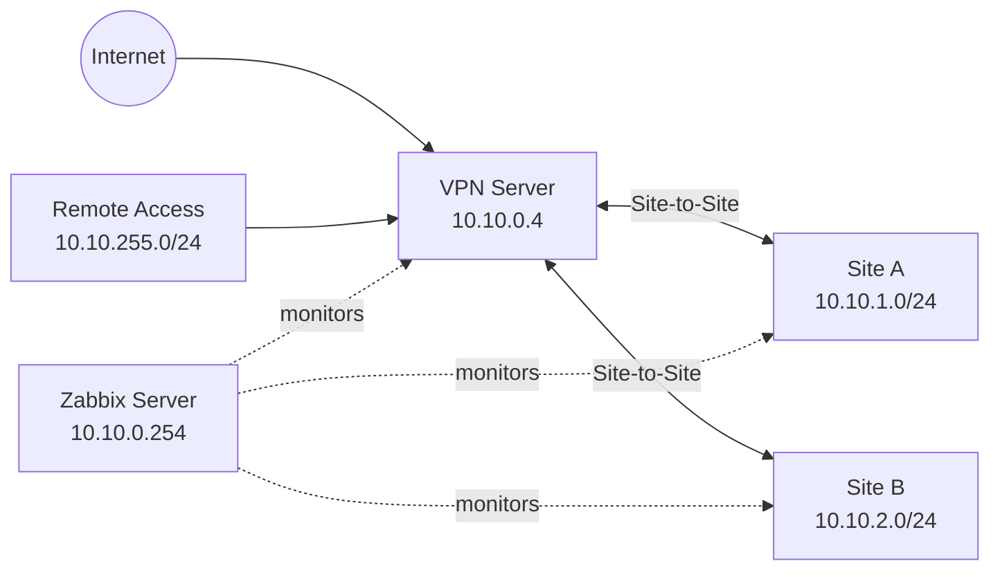

# HomeLab Infrastructure

[日本語](README.md) | [English](README.en.md)

AWSを現在の実装基盤として利用した、マルチサイトHomeLabの技術ポートフォリオです。Terraform、strongSwan、PKI、Zabbix、SNMPv3、障害通知を組み合わせ、再構築可能な監視基盤を構成しています。

## Architecture

## 構築内容

AWS上に配置したVPN・監視基盤で2つのサイトと証明書認証のRemote Access clientを接続しています。再現可能なInfrastructure as Code、運用監視、通知、再構築用ドキュメントを含みます。将来的な基盤移設を妨げないよう、公開artifactはprovider-neutralな構成で生成しています。

## 主要技術

AWS、Terraform、strongSwan、Site-to-Site VPN、EAP-TLS、PKI/CA/CRL、Cisco Catalyst 1300、MikroTik、SNMPv3、Zabbix、Python、systemd、Zabbix Agent2、GitHub。

## 設計目標

- 安全なRemote Accessとマルチサイト接続
- Infrastructure as CodeとSecret分離
- 障害検知、Slack通知、復旧通知
- canonical sourceからの再構築

## Network / VPN

公開用example topologyでは、AWS segment `10.10.0.0/24`、Site A `10.10.1.0/24`、Site B `10.10.2.0/24`、Remote Access `10.10.255.0/24`を使用します。Remote Accessは `vpn.example.com`、local traffic selector `10.10.0.0/16`のexample設定です。

## PKI / Remote Access

HomeLab CA、server/site certificate、client certificate、CRL生成、証明書の発行・失効手順を扱います。秘密鍵とcredentialはartifactに含めません。

## Monitoring

Server OS、VPN/collector、router、switch、NAS、ICMP-only access pointを監視します。運用フローは `Item → Trigger → Problem → Action → Slack → Recovery` です。

## Custom Implementations

- VICIから状態を取得しfreshnessとeventを正規化するPython VPN collector
- Catalyst 1300のtemperature、sensor status、power監視
- Zabbix templateとfrontend module
- DashboardとSlack Action定義
- systemd、Agent2、logrotate連携

## Infrastructure as Code

Terraformでmonitoring subnet、route、security group、IAM、SSM document、固定AMI方式のZabbix EC2設計を管理します。

## Security Design

SecretはGit外から注入します。least-privilegeなnetwork rule、certificate authentication、allowlist方式のexport、fail-closed validationを採用しています。

## Failure Detection

`Item → Trigger → Problem → Action → Slack → Recovery`を障害通知の基本チェーンとします。

## Rebuildability

canonical source、sanitized template、collector、systemd定義、Terraform、rebuild documentationをruntime stateやcredentialから分離して管理します。

## 設計判断の概要

### VPN visibility

Problem: 標準監視だけではVPN SA/sessionの可視性が不足します。
Design: Python collectorでVICI状態を正規化し、Agent2経由でZabbixへ渡します。
Implementation: collector、freshness/state Item、Dashboard、frontend moduleを組み合わせています。
Operational Result: Site-to-SiteとRemote Accessの状態・履歴を監視フローへ接続できます。

### Catalyst 1300 monitoring

Problem: Generic SNMPだけではdevice-specific telemetryが不足します。
Design: 実機応答を確認したSNMPv3 objectだけを採用します。
Implementation: custom templateでtemperature、power、CPU telemetry、sensor stateを監視します。
Operational Result: 未確認のmemory/fan metricは無理に作らず、設計上の例外として扱います。

### End-to-end notification

ItemからTrigger、Problem、Action、Slack、Recoveryまでを一つの運用チェーンとして確認します。

## Design Decisions

### VPN visibility

Problem: Standard monitoring alone did not expose sufficient VPN SA/session visibility.
Design: A Python collector normalizes VICI state and exposes it through Agent2.
Implementation: Collector freshness/state Items, a dashboard, and frontend modules connect the data to Zabbix.
Operational Result: Site-to-Site and Remote Access state and history participate in the monitoring flow.

### Catalyst 1300 monitoring

Problem: Generic SNMP did not expose enough device-specific telemetry.
Design: Only SNMPv3 objects verified against the device are used.
Implementation: A custom template monitors temperature, power, CPU telemetry, and sensor state.
Operational Result: Unverified memory and fan metrics remain intentional design exceptions.

### End-to-end notification

The operational chain is verified as Item -> Trigger -> Problem -> Action -> Slack -> Recovery.

## Repository Structure

- [Architecture](docs/architecture.md)
- [VPN](docs/vpn.md)
- [Monitoring](docs/monitoring.md)
- [Security](docs/security.md)
- [Rebuildability](docs/rebuildability.md)
- [terraform/](terraform/)
- [strongSwan/](strongswan/)
- [monitoring/](monitoring/)
- [Architecture](docs/architecture.md)
- [VPN](docs/vpn.md)
- [Monitoring](docs/monitoring.md)
- [Security](docs/security.md)
- [Rebuildability](docs/rebuildability.md)
- [terraform/](terraform/)
- [strongSwan/](strongswan/)
- [monitoring/](monitoring/)
生成artifact内の `docs/`、`terraform/`、`strongswan/`、`monitoring/`を参照してください。

## Sanitization Notice

このrepositoryはPrivateなHomeLabから生成したsanitized portfolioです。実アドレス、実site名、FQDN、AWS identifier、credential、private keyは置換または除外しています。

## このプロジェクトで示していること

Multi-site VPN、Remote Access VPN、certificate-based authentication、PKI lifecycle、Terraform IaC、SNMPv3/Agent2/ICMP monitoring、Python collector、custom Zabbix template、frontend module、end-to-end notificationを一つのHomeLabとして設計・実装・運用する例です。公開artifact、runtime、secretを分離し、rebuild documentationまで整備しています。
