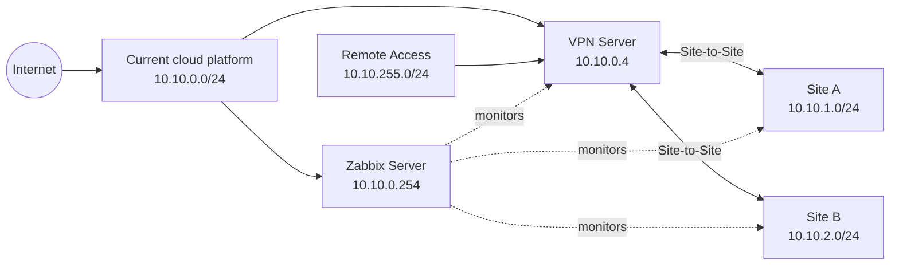

# Architecture

この文書は、実環境値を公開用exampleへ置換したアーキテクチャ概要です。図中のnetwork、host、endpointは公開用の値であり、production configurationではありません。

## Data flow

Network and service telemetry is collected by Zabbix Items, evaluated by Triggers, and turned into Problems. Actions deliver Problem and Recovery notifications through Slack. The VPN collector adds normalized Site-to-Site and Remote Access state to this flow.

## Scope and boundaries

The current implementation runs on AWS, while the design intentionally keeps the portfolio provider-neutral. Credentials, runtime state, raw inventory, and environment-specific identifiers are excluded. Rebuildable examples are documented in [rebuildability](rebuildability.md).
