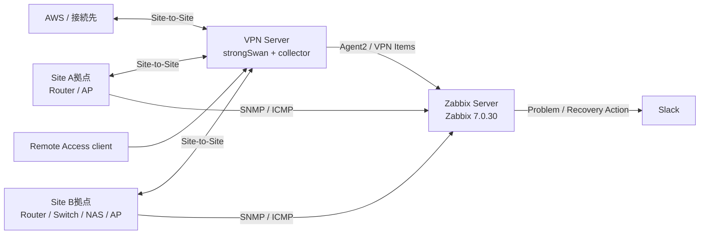

# HomeLab architecture

この文書は、現在の実運用構成と repository の canonical source を対応付ける。IP、ID、秘密値は環境依存であり、secret は記載しない。

## 概要

HomeLab は AWS 側の接続先と、Site A・Site Bの拠点ネットワークを Site-to-Site VPN で接続する。VPN Server (`VPN Server`, host 10002) は strongSwan と独自 collector を実行し、Zabbix Server (`Zabbix server`, host 10001) は監視、Problem、Action、Slack 通知を担当する。Remote Access VPN は同じ VPN Server 上で終端する。

主要な監視対象は、Zabbix Server、VPN Server、Site Aルータ、Site Bルータ、Site Bスイッチ、Site B NAS、Site A AP、Site B AP の8ホストである。詳細な host/template/interface 対応は [inventory](monitoring.md) と [machine-readable inventory](monitoring.md) を参照する。

## 構成図

## 監視データフロー

通常監視は `Device / OS / Service -> Zabbix Item -> Trigger -> Problem -> Action -> Slack` である。復旧は `Recovery -> Action -> Slack Recovery` となる。

VPN 独自監視は `strongSwan (VICI list-sas) -> homelab-vpn-collector.py -> runtime state / sanitized event log -> Zabbix Agent2 -> Zabbix Items -> Triggers / log history -> custom frontend modules / Dashboard -> Slack` である。collector は `list-sas` の read-only 応答を論理状態に正規化し、SA の rekey を独立イベントにしない。

## ネットワーク上の役割

|役割|実環境で確認した値|
|---|---|
|Zabbix Server|10.10.0.254（SSH 接続先、Zabbix host の agent interface は loopback）|
|VPN Server|10.10.0.4|
|Site Aルータ|10.10.1.1|
|Site Bルータ|10.10.2.1|
|Site Bスイッチ|10.10.2.2|
|Site B NAS|10.10.2.3|
|Site A AP|10.10.1.130|
|Site B AP|10.10.2.130|

これらは RFC1918 の HomeLab 内部アドレスであり、公開サービスの接続先として扱わない。

## 実装の所在

- Zabbix 独自 template/export: `monitoring/zabbix/templates/`
- host/coverage/Items: `monitoring/zabbix/inventory/`
- Slack Action の sanitized 仕様: `monitoring/zabbix/actions/slack-actions.json`
- Dashboard の sanitized payload: `monitoring/zabbix/dashboards/home-lab-overview-30001.json`
- VPN collector、unit、Agent2、logrotate: `monitoring/zabbix/collector/`
- Frontend modules: `monitoring/zabbix/modules/`
- 実運用の state/log は repository に保存しない。
